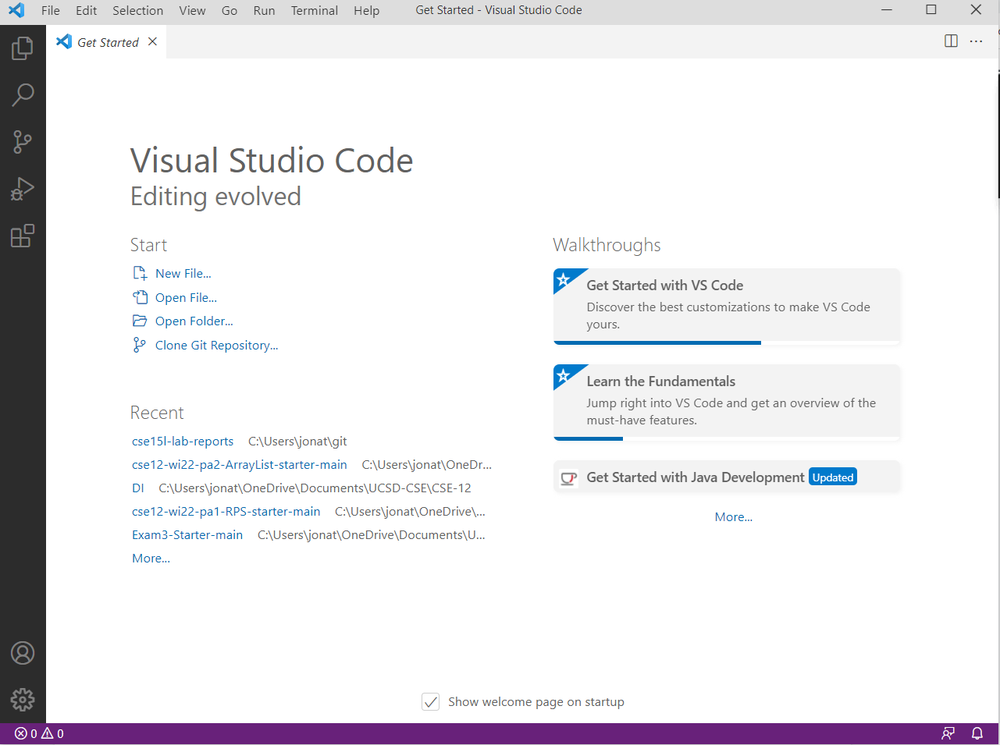
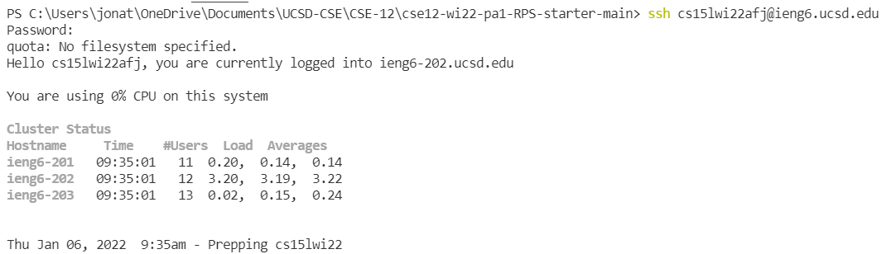
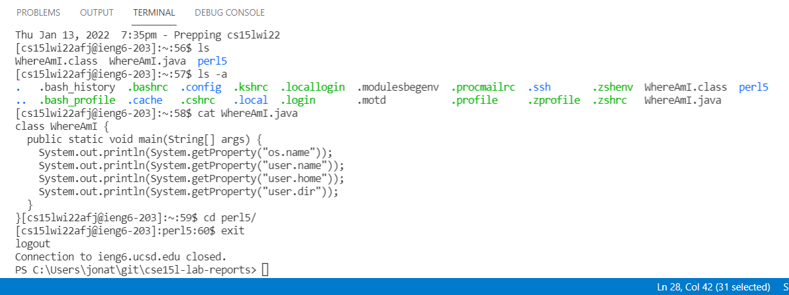
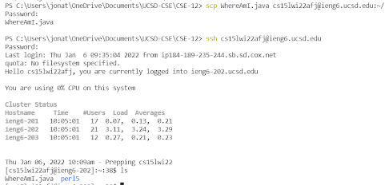
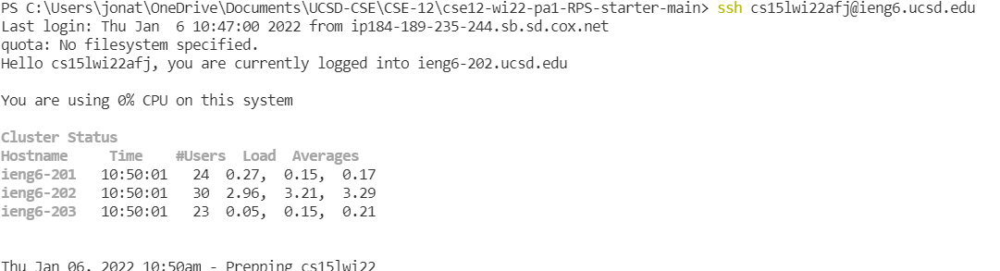
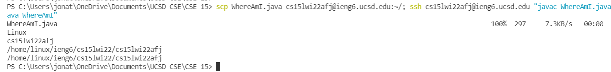

# Week 2 Lab Report: Remote Server Connections

> *This lab report will give the basic steps for connecting remotely to the UCSD ieng6 computers. Note these instructions are for Windows, MacOS steps may vary somewhat*


---
## Task 1: Installing VScode
> VS Code is a popular IDE that can be used for many programming tasks

1. Go to the [website for visual studio code]( https://code.visualstudio.com/)  and follow the download instructions for your operating system
2. Once you have downloaded VS Code, open the application. You  should see a window like this:



*Note: if your window is dark, change it to light mode by going to*
 > File->preferences->settings->appearance

 *Light mode is scientifically proven to be superior to dark mode*

---

## Task 2: Remotely Connecting
> *This section will step through remotely connecting to UCSD's ieng6 computer cluster. The steps for using ssh can be used to connect to different servers if you subsitute a proper address and credentials in.*

1.  Here we will be connecting to the server using ssh (secure shell protocol). Download OpenSSH on your computer using this [link](https://docs.microsoft.com/en-us/windows-server/administration/openssh/openssh_install_firstuse).
2. Next, go to [this link](https://sdacs.ucsd.edu/~icc/index.php) to look up your account credentials (you will have to update the default password before being able to login using the credentials)
3. Now we will actually connect to the server. Open VS Code and open a new terminal in it (Terminal->New Terminal)
4. Paste `ssh cs15lwi22???@ieng6.ucsd.edu` into the terminal, with the ??? replaced with your account specific identifier
5. The first time connecting to the server, you will be asked to confirm since the authenticity of the host can't be estabilshed. Enter 'yes'.
6. Enter your credential password. After this, you will be connected remotely to the UCSD server. Below is a terminal with the commands to ssh as explained above.



---
## Task 3: Trying Some Commands
> *Now that you have connected remotely to the server, try running some commands through the terminal. Listed below are some examples:*

* `cd` (change working directory)
* `ls` (list paths of current directory)
* `ls -a` (list all paths of the current directory, including hidden)
* `cat filename` (displays a files content)
* `cat > filename` (creates a new file)
* `mkdir directoryname` (creates a new directory in the present working directory)
* `man` (gives information on a command)
* `exit` (quits the ssh connection)

> *An example terminal using commands on the ssh server:*



> *more linux commands can be found [here](https://ss64.com/bash/)*
---
## Task 4: Moving Files with scp
> *Since we are connecting remotely to a server, we will likely want to transfer files to be stored and run on the server. To do so, we use the `scp` command*

 1. Create a new file on your computer (in this example the file is named WhereAmI.java)
 2. From the terminal (in the same directory as your file) use the following command:

 `scp WhereAmI.java cs15lwi22???@ieng6.ucsd.edu:~/` (make sure to put the correct name for *your* file name and server credentials)

 3. You will be prompted to login like when connecting to the server using ssh. Enter your password
4. Login using ssh. Using the `ls` command, you should be able to see your new file in the home directory.


> *Picture of terminal following the above steps to move a file*


---
## Task 5: Setting an SSH Key
> *To avoid the hassle of using a password to login every time we want to connect to the server, we can use an SSH key to verify our identity to save time.*

1. On the terminal, use the `ssh-keygen` command
2. Enter the directory you want to store the key in (example: /Users/yourname/.ssh/id_rsa)
3. Enter a passphrase for the ssh key
4. Open a terminal on Windows Powershell, and use the following code to add the key to your computer (code excerpt from Microsoft documentation).

```
#By default the ssh-agent service is disabled. Allow it to be manually started for the next step to work.

#Make sure you're running as an Administrator.

> Get-Service ssh-agent | Set-Service -StartupType Manual

#Start the service

> Start-Service ssh-agent

#This should return a status of Running

> Get-Service ssh-agent

#Now load your key files into ssh-agent

> ssh-add your_key_path

```
5. On the remote server, create a .ssh directory and copy your public key to it using the scp command

```
$ ssh ________ (log onto server)

#on server
$ mkdir .ssh
$ exit

#on your computer
scp your_public_key_path cs15lwi22???@ieng6.ucsd.edu:~/.ssh/authorized_keys
```
> *Now, you should be able to log into the server without using a password like below*



---
## Task 6: Optimizing Remote Running
> *Here are a few last tips to make using a remote server and terminal easier*

* You can write a linux command in quotes after the ssh command. This will run the commands on the server, then disconnect
* You can run multiple commands on one line by seperating them with semicolons. This works with the above tip as well (note that any commands added after the quotes will run after disconnecting from the ssh)
* You can access previous commands by using the up arrow

> *example of using multiple commands on one line and combining ssh with commands*



---