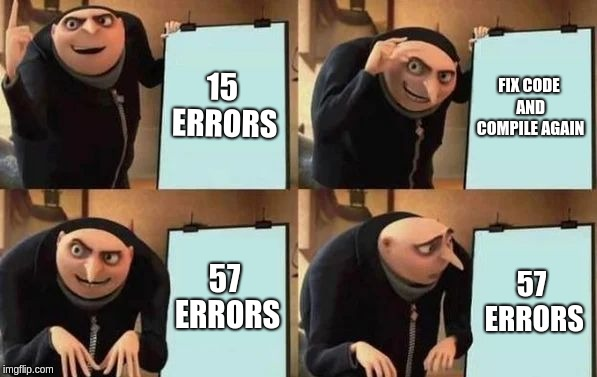

# Week 4 Lab Report: Debugging MarkdownParse.java

> *This lab report will go over the debugging process for code that prints all the links in a markdown file.*

> *[Image Source](https://www.reddit.com/r/ProgrammerHumor/comments/9g4vml/debugging_be_like/)*
---
## Change 1: 
> Fix an infinite loop when [] appear without a link after it

* In this case, the bug was a failure to handle the case of [] appearing without a link directly after in the file. This caused the program to enter an infinite loop since the break condition was based off of the index of the next ")", which was returned as negative 1. This caused the symptom of a OutOfMemoryError after the program looped enough to fill the stacks memory.

* [failure inducing input file](https://jdweak.github.io/cse15l-lab-reports/report-2-mdfiles/break1-file.md.html)

> *Bug was fixed by adding a check to see if the character after the [] is a "(" and adding a break condition to the while loop to check if the current index was negative*

---

## Change 2:
> *Fixing an IndexOutOfBoundsException when the file ends in "]"*

* In this case, the bug was a failure to handle the case of a file ending in "]". This was caused by the new check added in change 1 to see if a link was really after a "]". Since the code checks the next character after the "]", a file ending with a "]" will try to check an out of bounds index, resulting in the symptom of throwing an IndexOutOfBoundsError.

* [failure inducing input file](https://jdweak.github.io/cse15l-lab-reports/report-2-mdfiles/break2-file.md.html)

> *Bug was fixed by adding a try catch around the code checking the next character after "]". If an IndexOutOfBoundsException was thrown, the code would break the loop since it is at the end of the file*

---
## Change 3:
> *Fixing a bug that prints non links when no [] are in the file and the file starts with "("*

* In this case, the bug was a failure to handle the case of words in parenthases appearing in the file with no []. Since the file looked for () after the index of "]" (being -1 since it's not in the file), it would find and accept the "(" at the beginning of the file. This caused the symptom of printing out the word in parentheses without it being a link.

* [failure inducing input file](https://jdweak.github.io/cse15l-lab-reports/report-2-mdfiles/break3-file.md.html)

> *Bug was fixed by adding a check to make sure the index for "[" and "]" was not -1 (ie they are in the file).*

