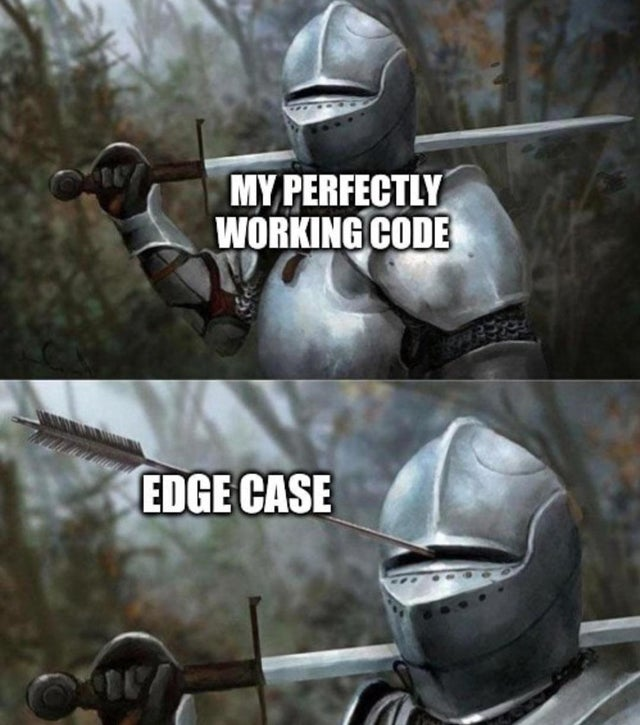
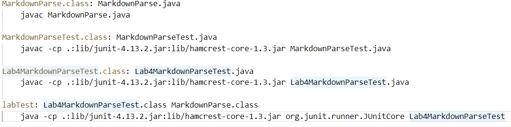
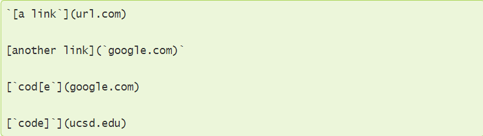
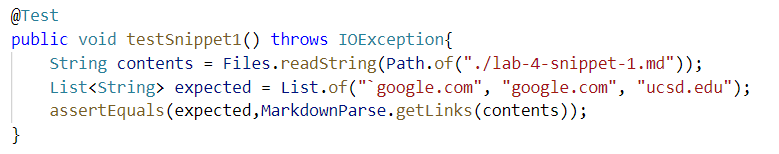
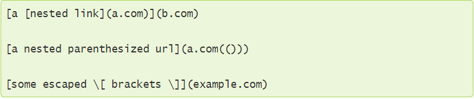
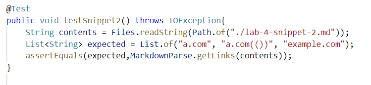
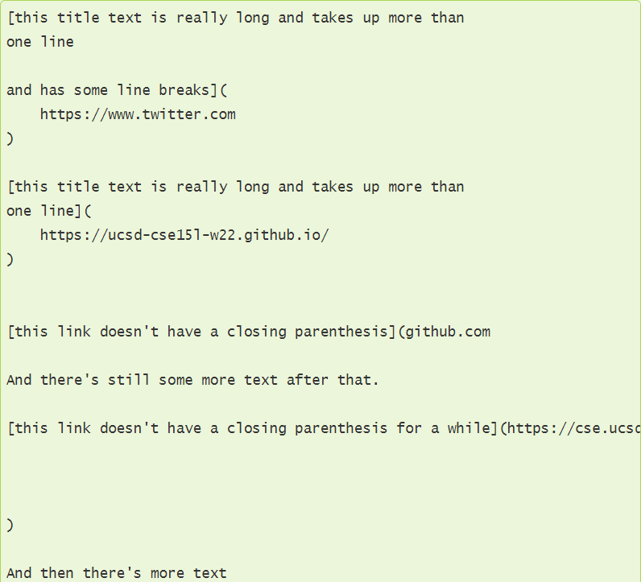
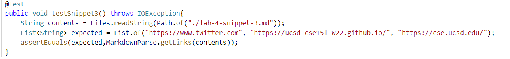

# Week 6 Lab Report: MarkdownParse Script Debugging

> *This lab report will go over the testing of my and another student's 
>  MarkdownParseCode against edge cases.*


*[Image Source](https://www.reddit.com/r/ProgrammerHumor/comments/oxq5no/edge_cases_be_like/)*

---

## MarkdownParse and Testing Procedure 
> The programs being tested are called MarkdownParse.java. The script takes a
> markdown file name as an input and is supposed to return a list of  all of the
> properly formatted links in the file. We test edge cases using JUnit tests and
> run them here using a Makefile.



*The above picture shows the Makefile for running the Junit tests in the lab.
The Junit tests are in a class called Lab4MarkdownParseTest and the tests can be
run using the command ```make labTest```*

* Below are the github links for the two MarkdownParse programs we are testing

    * [My MarkdownParse](https://github.com/jdweak/markdown-parse)
    * [Other Student's Markdownparse](https://github.com/ucsd-cse15l-w22/markdown-parse)

---

## Markdown Snippet 1
> Here we go over testing how the programs handle the first edge case snippet shown
> below



1. Using the preview slide of visual studio code, we can determine that our
   MarkdownParse programs should return a list of [`google.com, google.com,
   ucsd.edu].
2. We can now write a JUnit test to compare the values returned by Markdownparse
   to our expeced values:
   
3. Running the Junit using our Makefile command, we get the following output
   when testing MarkdownParse on snippet 1:

> Other Student's MarkdownParse:


* This implementaiton fails on snippet 1. We can see this in the
  java.lang.AssertionError, meaning the returned value was different than the
  expected. It retuned url.com when it shouldn't have.

> My MarkdownParse:


* This implementaiton fails on snippet 1. We can see this in the
  java.lang.AssertionError, meaning the returned value was different than the
  expected. The program returned url.com when it shouldn't have and failed to
  return ucsd.edu.

 * There is not a small code change that will allow the program to handle this
   edge case. Conceptually, you would need to have the program ignore all
   instances of inline code using barticks (ie take them out of the text
   considered when the program is running). However, since there are also edge
   cases in creating inline code (ex in snippet 1 si where the parentheses cuts
   it off in the second link) you would need to write a large amount of code to
   figure out what to exclude.


---
## Markdown Snippet 2
> Here we go over testing how the programs handle the second edge case snippet shown
> below



1. Using the preview slide of visual studio code, we can determine that our
   MarkdownParse programs should return a list of [a.com, a.com(()), example.com].
2. We can now write a JUnit test to compare the values returned by Markdownparse
   to our expeced values:
   
3. Running the Junit using our Makefile command, we get the following output
   when testing MarkdownParse on snippet 2:

> Other Student's MarkdownParse:


* This implementaiton fails on snippet 2. We can see this in the
  java.lang.AssertionError, meaning the returned value was different than the
  expected. The program returned b.com when it shouldn't have and didn't return
  a.com even though it should have.

> My MarkdownParse:


* This implementaiton fails on snippet 1. We can see this in the
  java.lang.AssertionError, meaning the returned value was different than the
  expected. The program did not return any links even though it should have.

 * There is a relatively small code addition that could be added to handle this
   edge case. It
   would involve changing the code for finding new square brackets and parentheses to check for
   nesting. In essence it would keep track of new open parentheses or square
   brackets and only return the closed index when it matches how many open
   things there are (ex if there are 2 open [ the code would only return the
   closed index once reaching the second ] after the starting index).   

---

## Markdown Snippet 3
> Here we go over testing how the programs handle the third edge case snippet shown
> below



1. Using the preview slide of visual studio code, we can determine that our
   MarkdownParse programs should return a list of [https://www.twitter.com, https://ucsd-cse15l-w22.github.io/, https://cse.ucsd.edu/].
2. We can now write a JUnit test to compare the values returned by Markdownparse
   to our expeced values:
   
3. Running the Junit using our Makefile command, we get the following output
   when testing MarkdownParse on snippet 3:

> Other Student's MarkdownParse:


* This implementaiton fails on snippet 3. We can see this in the
  java.lang.AssertionError, meaning the returned value was different than the
  expected. Here we see that the program failed to return any of the expected
  links in the snippet.

> My MarkdownParse:


* This implementaiton fails on snippet 1. We can see this in the
  java.lang.AssertionError, meaning the returned value was different than the
  expected. The program failed to return any of the links in the snippet. 

 * There is a small code change that would allow the program to handle newlines
   nested in brackets and parentheses. Since newlines do not affect whether a
   link exists in md files, we want our code to ignore them. We can accomplish
   this by using the string function removeAll() to get rid of the newlines
   before running our program on the text.
---


