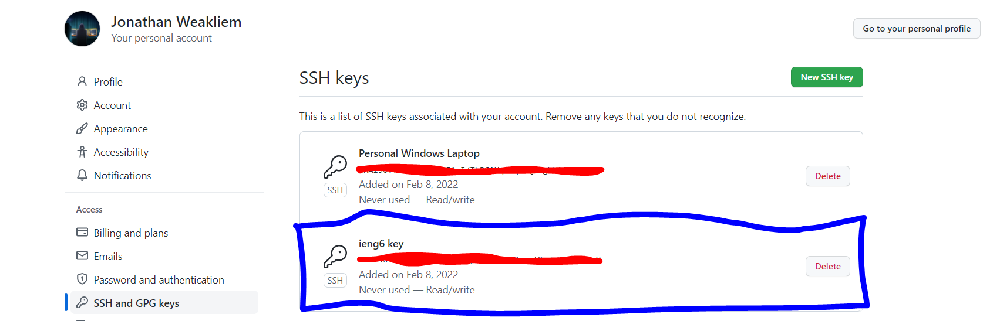

# Week 4 Lab Report: Remote Github Access

> *This lab report will go over how to add an ssh key to your github in order to
> be able to push changes from a remote server.*


*[Image Source](htt/s://github.com/hendrixroa/in-case-of-fire/blob/master/README.md)*

---

## SSH and GitHub: 
> Recently, Github removed support for using password authentication for pushing
> from the command line, now requiring ssh keys.


*As you can see, when trying to push changes on the ieng6 remote server we are
given an error. We can get around this by adding an ssh key to our Github
account*

---

## Linking SSH to your GitHub
> Here we will go over the steps for adding an ssh key to your github

1. From your remote server, create a new ssh key by using the ```ssh-keygen```
   command. More detailed instructions can be found on [lab report
   1](https://jdweak.github.io/cse15l-lab-reports/lab-report-1-week-2.html).
   
   * Your new public and private ssh keys can be found in the .ssh folder:


   
2. Navigate to your .ssh folder and copy the contents of your PUBLIC ssh key.
   This can be done by using ```cat <public key file location>```. This will
   print the contents to the terminal, which can then be selected and copied.

3. Navigate to your GitHub account, then go Settings->SSH and GPG keys->New SSH
   Key

4. Paste in the contents of the public key that you copied earlier, name the key
   something descriptive of its location/use (ex ieng6 key)

    * Your key should now be visible in your GitHub SSH keys list:



5. Importantly, we have to make sure our git is using SSH instead of HTTPS
   protocol. Navigate to your repository, click on code->SSH->copy

6. SSH back to your remote server, then navigate to your git repository
   location. Enter ```git remote set-url origin <your copied git ssh orgin>```

7. Now, we should be set up for using git with ssh keys

---

## Demonstration
> Lets demo here how we can now push changes to the orgin on the terminal from
> the remote server

* First we'll create a new file in our repository called newFile.md using the
  ```touch``` command, then commit it by using ```git add newFile.md``` and
  ```git commit -m "commit message"```


* Next, we'll push our local commit to the remote orgin using ```git push```.
  Notice we are able to do this now since we have set up our ssh key.


* Going back to our global repository, we can now see our new file with its
  commit message (repo can be found [here](https://github.com/jdweak/skill-demo))


---


