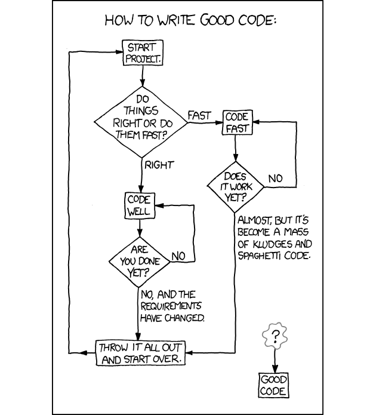
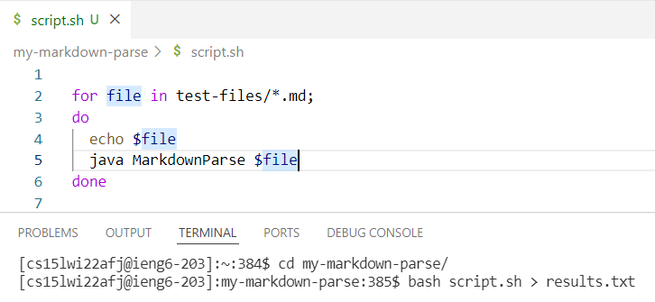
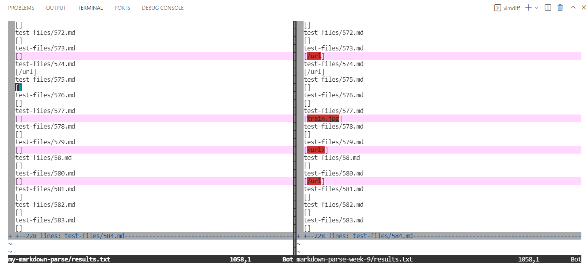
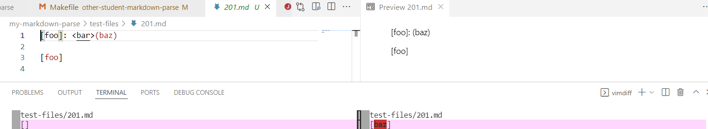
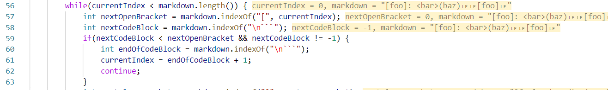
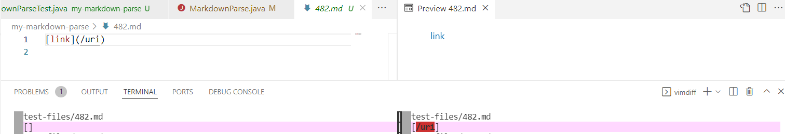
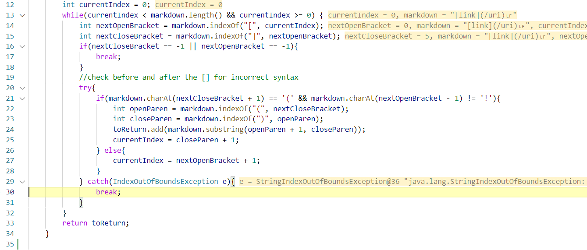

# Week 10 Lab Report: MarkdownParse Implementation Comparison

> This lab report will run my and a provided MarkdownParse implementation and
> run it against a large folder of markdown files. Two test files where the
> outputs are different will be chosen to analyze. 



      ^^ Me doing MarkdownParse since week 3 ^^

*[Image
Source](https://www.freecodecamp.org/news/coding-explained-in-25-profound-comics-8847ea03819c/)*


---

## General Procedure
> How can we see what tests get different output for our two implementations of
> MarkdownParse?

* First, we need to get the results of the different implementations to compare.
  We can store these results in a text file using a bash script to call
  MarkdownParse on every file in our test directory, then use the > symbol to
  output it to a text file.



* Next, we can compare out outputs using the vimdiff command. vimdiff will open a vim editor with
  all the differences in output for the files we give it in in the command line.
  In this case we will call ```vimdiff my-markdown-parse/results.txt markdown-parse-week-9/results.txt```.




* After finding test files that produce different outputs, we can use VS Code's
  preview window to determine what links should be outputed to determine which
  implementation failed the test.

---

## First Test File Comparison: 201.md 
> Using vimdiff, we find that the implementations have different outputs on
> 201.md

* Using the VS Code preview window, we see that no links should be printed out,
  however the given implementation (markdown-parse-week-9) incorrectly outputs
  "baz"



**The bug:**
* In this case, a link is not in the markdown file due to the "\<bar>" that
  comes between the [foo] and the (baz). The "\<" invalidates the link following
  it. While the code does check for some dangerous characters like this (the ```
  for code chunks) it does not check for "\<", therefore the script thinks this
  should be a link. This could be fixed by adding a check for this character in
  a similar manner to checking for code chunks.



*notice how above the only check is for the ``` codeblock characters. Since
there is no check for <, the program continues through the method thinking that
the current iteration has a valid link*

---
## Second Test File Comparison: 482.md 
> Using vimdiff, we find that the implementations have different outputs on
> 482.md

* Using the VS Code preview window, we see that the linke /uri should be printed,
  however my implementaion incorrectly outputs
  nothing



**The bug:**
* The bug stems from an attempt in my code to handle an edge case of checking if
  a link is in fact an image when the first character in the markdown is "[". To
  do this, you need to check if there is an "!" before the "[", but since the
  "[" is the first character in the string this would throw an
  IndexOutOfBoundsException. I tried to handle this using a try catch, however I
  incorrectly called break on the catch, which ends the while loop iterating
  through the markdown and prematurely returns the list its building (which at
  this point contains nothing).

  

  *Notice how in the above code the break is called after the
  IndexOutOfBoundsException is thrown when trying to check before the first "[".
  Instead of breaking, this execute the same code as inside the if statement, as
  it implicitly means that there is no "!" before the "[", making it a good link
  in this context.*

  ---